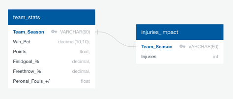

# NBA Injuries

For this project my team and I wanted to look at how injuries impact different team in the National Basketball Association. First step was to find a good source for this data, we landed on [Kaggle](https://www.kaggle.com/). We were able to find a CSV file that outlined every injury in the NBA from the year 2010-2020, that proved to be exactly what we needed. 
Another key component would be the data for each NBA team over the course of each season. To obtain this data once again we searched [Kaggle](https://www.kaggle.com/) and was able find another CSV file that was very detailed with a variety of different statistics. As a result, we can determine the impact of injuries in regards to different things such as wins/losses, points, shooting percentages, etc.

For the Team Statistics we dropped all of the stats that we weren’t interested in.  We then concatenated the Team Name and Season so that it would match the Primary Key from the Injury Data.
The injuries were listed by date. We were interested in which season that the injury occurred. NBA seasons run from October to April over two different calendar years. For example, an injury in 2018 could have occurred during the 2017-2018 Season or the 2018-2019 Season. We wanted to match the exact format from the statistics data: Team Name and then Season. (For example: “2018-19 Portland Trail Blazers”). For this reason, we had to calculate the fall games and spring games differently to get them into the correct category of season.  
To find the season for the fall games we created a data frame for all injuries after June. We will illustrate the calculations for an example injury occurring on Nov 15th, 2018. The column “first” was the year (ie 2018.). The column “last” was the last two digits of the next year (ie 19). To get that number we subtracted 1999. We then concatenated “first”, “-”, and “last” to get the Season (ie 2018-19).  
We did something similar for spring games. We created a data frame for all injuries before June. We will illustrate the calculations for an example injury occurring on April 15th, 2019. The column “first” was all four digits of last year (ie 2018 ). To get this we subtracted one from the year. The column “last” was the last two digits of this year (ie 19). To get this we subtracted 2000 from the year. We then concatenated “first”, “-”, and “last” to get the Season (ie 2018-19).  
After calculating the seasons for both spring and fall, we combined those two data frames. 
The names for the NBA teams in the injury data did not include the city. We expanded the names to match the formatting from the statistics data. (“Blazers” became “Portland Trailblazers”)  
In order to create a primary key to link the data we needed to include both the team and the season so we concatenated “Season”, ” “, and “Full Name”
Since the data listed every single injury on it’s own line, we grouped by the primary key, “Team Season” and counted the total number of injuries.
We then exported the final table of total injuries per team by season to a csv file.

To complete the project we brought our two datasets into SQL tables. 
We first made sure to drop the tables to ensure we do not overwrite them in this hypothetical database.
Then we created the tables using Team Season as our primary key for both tables.
Table 1 is named injuries_impact. We used varchar as our data type for Team Season because it has text, numbers, and special characters (-).
Table 2 is named team_stats. Again, we used varchar as our data type for Team Season. 
For each column that was a percentage (Win Pct, Fieldgoal %, and Freethrow %) we used the decimal data type.
For points we used float due to it being a standard number that isn't an integer. This number is an average so decimal points will be necessary. 
For Personal fouls +/- we used float as well for the same reason as Points.
Finally, we used the following code to show the results of the two tables and allow the user to begin their own analysis in SQL.

